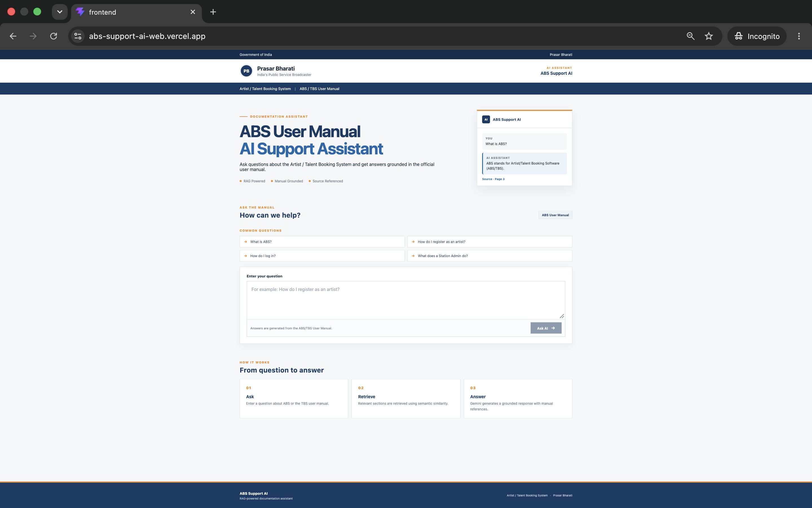
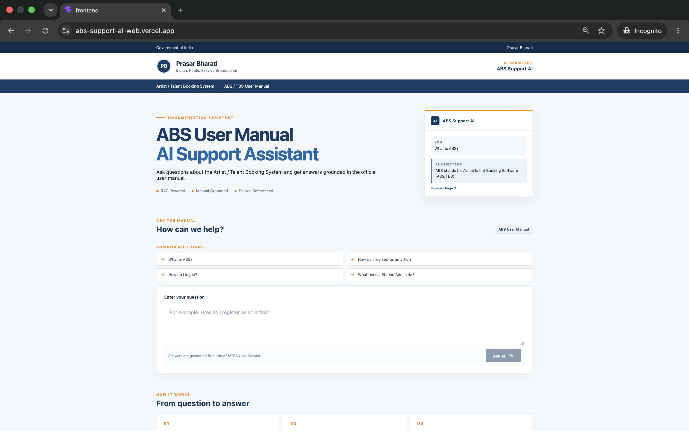
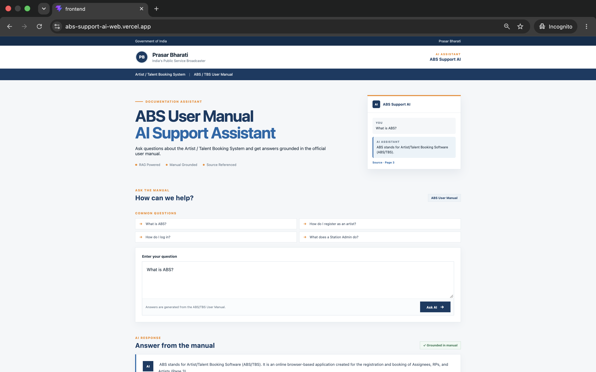
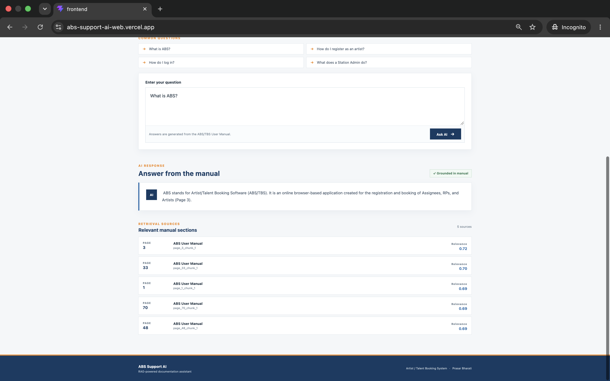
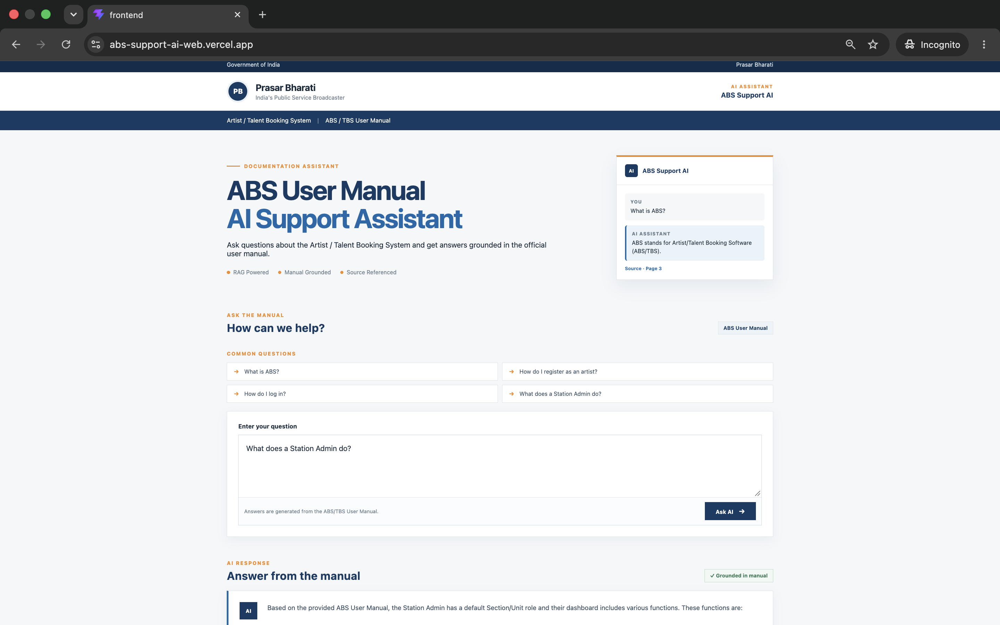
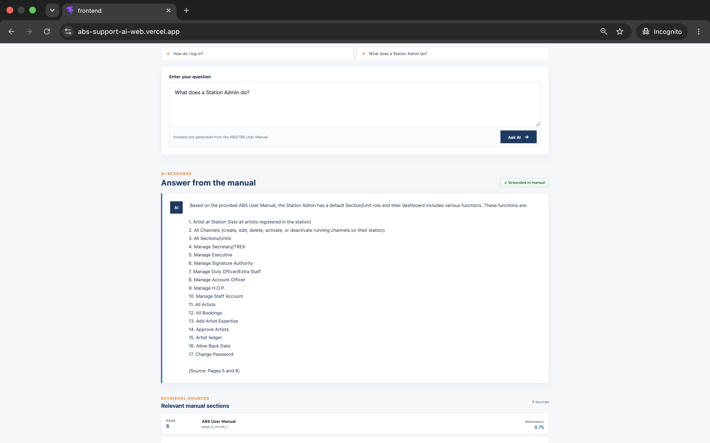
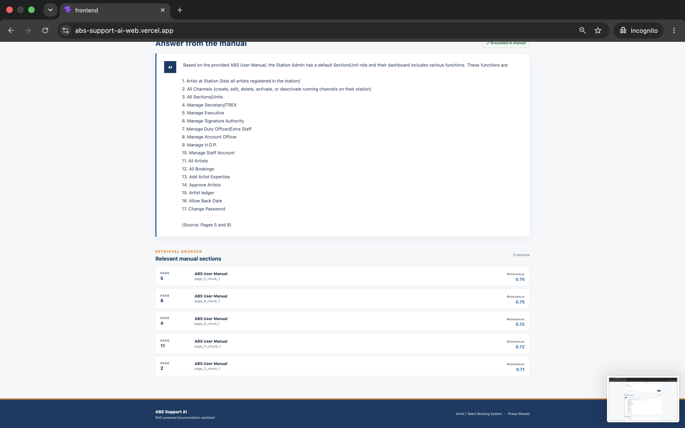

# ABS Support AI
# abs-support-ai

> Production-oriented RAG support assistant for the Prasar Bharati Artist/Talent Booking System (ABS/TBS) User Manual.

## 🚀 Live Demo

ABS Support AI is deployed as a React/Vite frontend with a FastAPI backend.

**Frontend:** See the live frontend link provided with this project.

**Backend API:** See the live API link provided with this project.

## 📸 Project Screenshots

### 1. ABS Support AI — Home Interface



### 2. User Query Interface



### 3. AI-Generated RAG Response



### 4. Retrieved Source References



### 5. Common Questions



### 6. How It Works



### 7. Responsive / Mobile Interface



## 📌 Overview

**ABS Support AI** is a document-grounded Generative AI application that allows users to ask questions about the **Artist/Talent Booking System (ABS/TBS) User Manual** using natural language.

The application uses **Retrieval-Augmented Generation (RAG)** to retrieve relevant sections from the manual before generating an answer with Gemini.

Instead of asking the LLM to answer entirely from its general knowledge, the application:

1. Receives the user's question.
2. Generates an embedding for the question.
3. Searches the stored manual embeddings.
4. Retrieves the most relevant document chunks.
5. Passes the retrieved context to Gemini.
6. Generates a grounded answer.
7. Returns source page information with the answer.

### Example

**Question**

```text
What is ABS?
```

**Answer**

```text
ABS stands for Artist/Talent Booking Software. It is an online
browser-based application created for the registration and booking
of Assignee/RP/Artist.
```

The response also identifies the relevant manual page.

---

# ✨ Key Features

* Natural-language question answering
* Retrieval-Augmented Generation (RAG)
* PDF-based knowledge retrieval
* Page-aware document chunking
* Gemini embeddings
* Semantic similarity search
* Cosine similarity retrieval
* Top-5 relevant chunks
* Grounded Gemini responses
* Source page attribution
* Similarity scores
* Unsupported-question fallback
* React + TypeScript frontend
* FastAPI backend
* Environment-based API configuration
* Production deployment on Vercel
* Lightweight architecture without a separate production vector database

---

# 🧠 Architecture

```text
                         User
                           |
                           v
                React + TypeScript + Vite
                           |
                           | POST /api/ask
                           v
                    FastAPI Backend
                           |
                           v
                 Gemini Query Embedding
                           |
                           v
              Cosine Similarity Retrieval
                           |
                  Top 5 Relevant Chunks
                           |
                           v
                  Grounded Gemini Prompt
                           |
                           v
                    Gemini LLM Response
                           |
                           v
              Answer + Source Page Numbers
```

---

# 🔎 RAG Pipeline

## 1. Document ingestion

The ABS/TBS User Manual PDF is processed using **PyMuPDF**.

The document text is extracted while preserving page information.

---

## 2. Page-aware chunking

The extracted manual content is divided into overlapping chunks.

Current dataset:

* **97 document chunks**
* Approximately **1200-character chunk size**
* Approximately **200-character overlap**
* Page metadata retained
* Chunk IDs generated for traceability

Example:

```text
page_3_chunk_1
page_3_chunk_2
page_4_chunk_1
```

---

## 3. Embedding generation

Each document chunk is converted into a vector embedding using:

```text
gemini-embedding-001
```

Current exported dataset:

```text
97 embeddings
3072 dimensions
```

The embeddings are stored in:

```text
data/embeddings.json
```

The corresponding document chunks are stored in:

```text
data/chunks.json
```

---

## 4. Query embedding

When the user submits a question, the application generates a query embedding using the same Gemini embedding model.

The query uses retrieval-query configuration.

---

## 5. Semantic retrieval

The query vector is compared against the stored document vectors using **cosine similarity**.

The application retrieves the five highest-scoring chunks.

```text
User Question
      ↓
Query Embedding
      ↓
Cosine Similarity
      ↓
Top 5 Chunks
      ↓
Relevant Manual Context
```

---

## 6. Grounded generation

The retrieved context is passed to Gemini with instructions to answer using the ABS/TBS User Manual.

The application is designed to avoid unsupported answers.

If the retrieved context does not support the question, the application returns:

```text
I couldn't find this information in the ABS User Manual.
```

---

## 7. Source attribution

The API returns:

* Generated answer
* Manual page
* Chunk ID
* Similarity score

Example:

```json
{
  "page": 3,
  "chunk_id": "page_3_chunk_1",
  "score": 0.7189
}
```

This makes the generated answer easier to verify against the source document.

---

# 🛠️ Technology Stack

## Frontend

* React
* TypeScript
* Vite
* CSS
* Vite environment variables

## Backend

* Python
* FastAPI
* Uvicorn
* NumPy
* python-dotenv
* Google GenAI SDK

## AI / RAG

* Generative AI
* Retrieval-Augmented Generation
* Gemini
* Gemini Embeddings
* Semantic Search
* Cosine Similarity
* Grounded Generation
* Source Attribution

## Document Processing

* PyMuPDF
* PDF text extraction
* Page-aware chunking
* Overlapping chunks
* JSON-based retrieval dataset

## Deployment

* Vercel
* FastAPI serverless deployment
* Vite frontend deployment

---

# 📁 Project Structure

```text
abs-support-ai/
│
├── api/
│   ├── ask.py
│   └── index.py
│
├── data/
│   ├── chunks.json
│   └── embeddings.json
│
├── frontend/
│   ├── src/
│   │   ├── App.tsx
│   │   ├── App.css
│   │   ├── index.css
│   │   └── main.tsx
│   │
│   ├── package.json
│   └── .env.local
│
├── rag/
│   ├── documents/
│   │   └── ABS_User_Manual.pdf
│   │
│   ├── read_pdf.py
│   ├── chunk_pdf.py
│   ├── chunks.txt
│   ├── ingest.py
│   ├── export_data.py
│   ├── retrieve.py
│   └── ask.py
│
├── requirements.txt
├── .gitignore
└── README.md
```

---

# 🔌 API

## Health Check

```http
GET /api/health
```

Expected response:

```json
{
  "status": "healthy",
  "chunks": 97,
  "embedding_dimensions": 3072
}
```

---

## Ask a Question

```http
POST /api/ask
Content-Type: application/json
```

Request:

```json
{
  "question": "What is ABS?"
}
```

Response:

```json
{
  "answer": "...",
  "sources": [
    {
      "page": 3,
      "chunk_id": "page_3_chunk_1",
      "score": 0.7189
    }
  ]
}
```

---

# 💻 Local Development

## 1. Clone the repository

```bash
git clone <repository-url>
cd abs-support-ai
```

---

## 2. Create Python virtual environment

```bash
python3 -m venv .venv
source .venv/bin/activate
```

---

## 3. Install backend dependencies

```bash
pip install -r requirements.txt
```

---

## 4. Configure Gemini

Create:

```text
.env
```

in the project root.

Add:

```env
GEMINI_API_KEY=your_gemini_api_key
```

Never commit this file.

---

## 5. Run FastAPI

From the project root:

```bash
uvicorn api.index:app --reload --port 8000
```

---

## 6. Configure frontend

Create:

```text
frontend/.env.local
```

Add:

```env
VITE_API_URL=http://127.0.0.1:8000
```

---

## 7. Install frontend dependencies

```bash
cd frontend
npm install
```

---

## 8. Start frontend

```bash
npm run dev
```

---

# 🔐 Environment Variables

## Backend

```env
GEMINI_API_KEY=your_gemini_api_key
```

## Frontend

```env
VITE_API_URL=http://127.0.0.1:8000
```

For production, `VITE_API_URL` points to the deployed FastAPI backend.

### Security

`GEMINI_API_KEY` must remain private.

Do not place the Gemini API key inside:

```text
VITE_*
```

Variables beginning with `VITE_` are included in the browser-side production build.

---

# 🧪 Testing

## Test 1 — Health

Verify:

```text
status = healthy
chunks = 97
embedding_dimensions = 3072
```

---

## Test 2 — Supported Question

Ask:

```text
What is ABS?
```

Expected behavior:

* Relevant manual content is retrieved.
* Gemini generates a grounded answer.
* Source page information is returned.

---

## Test 3 — Registration Question

Ask:

```text
How do I register as an artist?
```

The application should retrieve the relevant sections from the manual and generate a grounded response.

---

## Test 4 — Login Question

Ask:

```text
How do I log in?
```

The application should retrieve the relevant manual content.

---

## Test 5 — Unsupported Question

Ask something unrelated to ABS/TBS.

The system should avoid inventing information and return:

```text
I couldn't find this information in the ABS User Manual.
```

---

# 🎯 Design Decisions

## Why RAG?

The application needs to answer questions about a specific operational document.

RAG allows the LLM to use the source manual as contextual information instead of depending entirely on its pretrained knowledge.

This also makes the answer more traceable.

---

## Why cosine similarity?

The current dataset is relatively small.

Cosine similarity provides a simple and transparent way to compare the semantic relationship between the user query and stored document embeddings.

It also keeps the architecture lightweight.

---

## Why JSON instead of a vector database?

The current dataset contains only 97 chunks.

For this portfolio implementation, storing exported chunks and embeddings in JSON keeps the system:

* Simple
* Inspectable
* Easy to deploy
* Easy to explain during interviews
* Low infrastructure overhead

For a larger production system, a vector database or PostgreSQL with pgvector would be a natural next step.

---

# 🏗️ Production Evolution

The current implementation is intentionally lightweight.

A larger enterprise version could add:

* PostgreSQL
* pgvector
* Object storage
* Background ingestion jobs
* Document versioning
* Metadata filtering
* Authentication
* Authorization
* Multi-tenant data isolation
* Retrieval evaluation
* Automated RAG evaluation
* Observability
* Tracing
* Rate limiting
* Response caching
* Retry policies
* Timeout handling
* Model fallback
* Prompt/version management
* CI/CD
* Containerization

---

# 🔒 Security Considerations

* Never commit `.env`.
* Never expose `GEMINI_API_KEY` to the frontend.
* `VITE_API_URL` is public configuration, not a secret.
* Do not expose sensitive enterprise documents without appropriate authorization.
* Production applications should use authentication and authorization where required.
* API rate limiting should be added for public production usage.

---

# 📊 What This Project Demonstrates

This project demonstrates practical **AI Engineering** rather than simple prompt experimentation.

### AI Engineering

* RAG
* Embeddings
* Semantic retrieval
* LLM integration
* Grounded generation
* Source attribution

### Backend Engineering

* Python
* FastAPI
* REST API
* Environment configuration
* Error handling
* Retrieval orchestration

### Frontend Engineering

* React
* TypeScript
* Vite
* API integration
* Production frontend deployment

### AI Application Architecture

* Document ingestion
* Chunking
* Embedding generation
* Retrieval
* Prompt construction
* LLM generation
* Source verification

### Deployment

* Vercel
* Separate frontend/backend deployment
* Production environment configuration
* Live API verification

---

# 💼 Interview Explanation

A concise interview explanation:

> I built a production-deployed RAG support assistant for the ABS/TBS User Manual. I first extracted the PDF using PyMuPDF, created page-aware overlapping chunks, and generated Gemini embeddings for those chunks. At query time, the FastAPI backend embeds the user's question, calculates cosine similarity against the stored embeddings, selects the top five relevant chunks, and passes them to Gemini as grounded context. The API returns the generated answer along with source metadata such as page number, chunk ID, and similarity score. I then integrated the API with a React/Vite frontend and deployed the frontend and backend separately on Vercel.

---

# 🧠 Key Interview Concepts

Be prepared to explain:

### What is RAG?

Retrieval-Augmented Generation combines information retrieval with LLM generation.

### Why embeddings?

Embeddings convert text into vectors so semantically related content can be compared mathematically.

### Why cosine similarity?

It measures the directional similarity between vectors and works well for semantic retrieval.

### Why chunk documents?

LLMs have context limitations, and smaller chunks allow the retrieval system to provide more targeted context.

### Why overlap chunks?

Overlap helps prevent important information from being split between two chunks.

### Why top-k retrieval?

Top-k limits the amount of retrieved context while providing multiple potentially relevant passages.

### How do you reduce hallucination?

The system retrieves source context and instructs Gemini to answer only from the provided ABS/TBS manual content.

### How do you verify answers?

The response includes source page information and retrieval metadata.

---

# 🚀 Future Improvements

Potential next versions could include:

* Conversation history
* Streaming responses
* Source text previews
* Document upload
* Automatic re-indexing
* PostgreSQL + pgvector
* Authentication
* Role-based access
* Multi-user support
* Evaluation datasets
* Retrieval precision/recall measurement
* RAG evaluation
* Observability
* LLM tracing
* Response caching
* Automated CI/CD

---

# 📌 Project Status

**Production demo working.**

The application has been deployed with:

```text
React/Vite Frontend
        ↓
Vercel
        ↓
FastAPI Backend
        ↓
Gemini Query Embedding
        ↓
97 Manual Chunks
        ↓
Cosine Similarity
        ↓
Top-5 Retrieval
        ↓
Gemini
        ↓
Grounded Answer
        ↓
Source Page
```

The end-to-end flow has been verified using a live question about ABS.

---

# 👨‍💻 Project Focus

**AI Engineering • Generative AI • RAG • LLM Applications • FastAPI • React • Semantic Search • Cloud Deployment**

